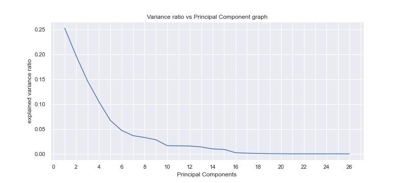
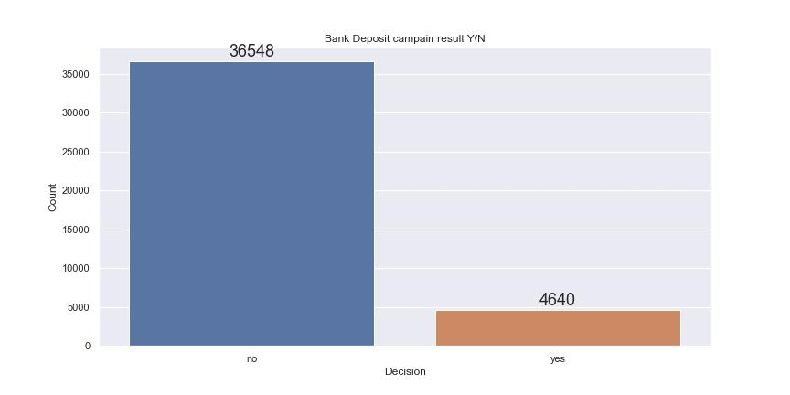
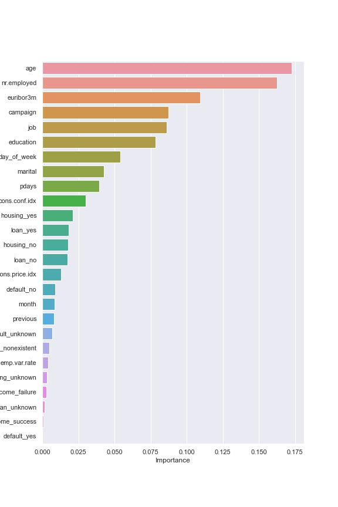

### Assignment Title
Practical Application III: Comparing Classifiers

The Goal is to compare the performance of the classifiers we encountered in this section, namely K Nearest Neighbor, Logistic Regression, Decision Trees, and Support Vector Machines. 

**Author**
Behailu Desta

#### Executive summary

Overview: In this practical application, your goal is to compare the performance of the classifiers we encountered in this section, namely K Nearest Neighbor, Logistic Regression, Decision Trees, and Support Vector Machines. We will utilize a dataset related to marketing bank products over the telephone.

The Bank of Portugal is seeking to develop a model capable of forecasting which potential customers will sign up for their term deposit service. By implementing a successful predictive model, they aim to improve the efficiency of their marketing campaigns by targeting individuals who are more likely to subscribe to their service. This will enable them to allocate their resources more effectively. The dataset under consideration pertains to the direct phone marketing campaigns conducted by a Portuguese bank between May 2008 and November 2010, which were designed to encourage existing customers to opt for their term deposit service.

#### Rationale
Marketing expenditure in the banking industry is massive, meaning that it is essential for banks to optimize marketing strategies and improve effectiveness. Understanding customers’ need leads to more effective marketing plans, smarter product designs and greater customer satisfaction.

Background: In the present time, the banking industry is spending a significant amount of money on marketing. As a result, it is crucial for banks to enhance the efficiency of their marketing strategies. By gaining an understanding of the customers' requirements, banks can develop more effective marketing plans and create smarter product designs, which ultimately leads to greater customer satisfaction.

Through the examination of customer characteristics, such as demographic information and past transactions, the bank can anticipate the saving habits of its customers and pinpoint the group of customers who are more inclined to make term deposits. By targeting these customers, the bank can allocate its marketing resources more efficiently, resulting in a more effective deposit acquisition strategy. Additionally, this approach can lead to improved customer satisfaction as it reduces the frequency of irrelevant advertisements for certain customers.

#### Research Question
Increase the effectiveness of the bank's telemarketing campaign. This project will enable the bank to develop a more granular understanding of its customer base, predict customers' response to its telemarketing campaign and establish a target customer profile for future marketing plans.

The aim of this project is to enhance the efficiency of the bank's telemarketing campaign. This can be achieved by gaining a more detailed understanding of the bank's customer base, predicting the customers' reactions to the telemarketing campaign, and identifying a target customer profile that can be used for future marketing strategies.

#### Data Sources

Our dataset comes from the UCI Machine Learning repository link. The data is from a Portugese banking institution and is a collection of the results of multiple marketing campaigns. We will make use of the article accompanying the dataset here for more information on the data and features.

#### Methodology
we have used the four common classification models namely, 
- K Nearest Neighbor.
- Logistic Regression.
- Decision Trees.
- Support Vector Machines.

These are the main steps followed in this project.

- Data collection and cleaning: Collect data that is relevant to the classification task and remove any unnecessary data. Clean the data by handling missing values, removing duplicates, and addressing any inconsistencies or errors.

- Data preprocessing: Convert the raw data into a format that can be used by the model. we used scaling, OneHotencoding and feature selection using PCA.
  
- The data class provided is heavily imbalanced, we used Random Over Sampling and Random Undersampling to imporove model performance and reduce bias.
  

- Splitting data: Split the data into training and testing sets. The training set is used to train the model and the testing set is used to evaluate the model's performance.

- Choosing a model: Select a classification model that is appropriate for the task at hand. This may involve researching different models and comparing their performance on similar tasks.

- Training the model: Train the model on the training set using an appropriate algorithm and hyperparameters. This may involve techniques such as cross-validation or grid search to optimize the model's performance.

- Evaluating the model: Evaluate the model's performance on the testing set using appropriate metrics such as accuracy, precision, recall, F1 score and plot of confusion matrics for the different data models.

- Tuning the model: Adjust the model's hyperparameters  to optimize its performance on the validation set, we provide the comparision tables and confusion matrix plot.

#### Results/Findings

- Principal Component Analysis (PCA) was used to decrease the number of features required to train classifiers. This was primarily achieved by reducing the number of non-essential features by approximately 17 (from 26 down to 17) while maintaining almost 100% cumulative variance.

- On a 16GB Core i7 machine, SVM is known for being computationally intensive and slow to process, which can be a challenge in most cases.

- Decision Tree Classifier used to estimate the feature Importance for the 26 features. We find that the feature importance is the highest for the age, number of years employed, euribor 3 month rate ... etc.

- SVM and Decision Tree Classifier performed the best with the highest f1-scores (see PRC-Figure above and Table with scores). SVM took about 3000 to 67 times longer than the Decision Tree Classifier.

- We used the GridsearchCV for the best hyperparameters and performance optimization.

- Out of all the classifiers used, the Decision Tree Classifier exhibited the best f1-score performance, and fit time. 

#### Outline of project

- [Link to notebook](Practical_Application_3.ipynb)

